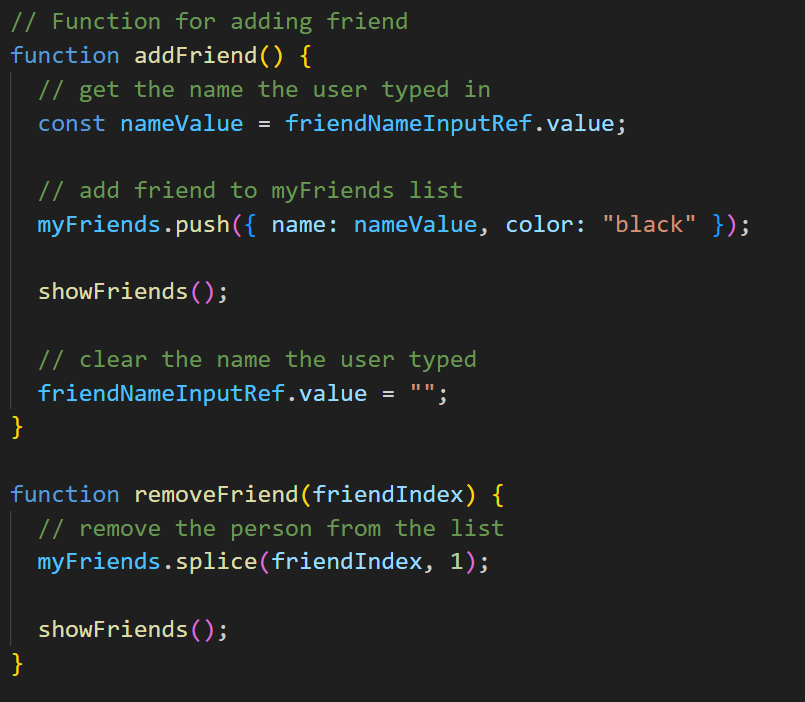
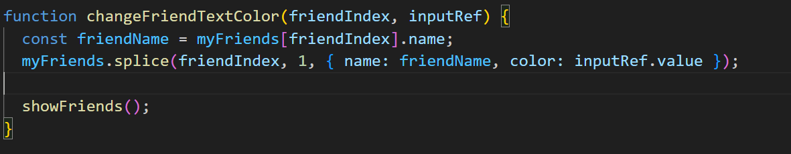
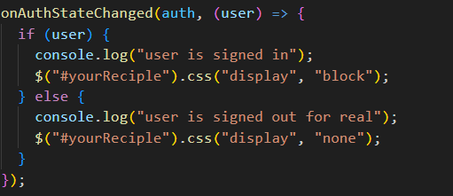
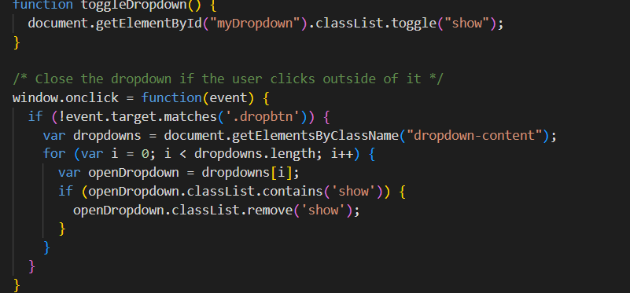
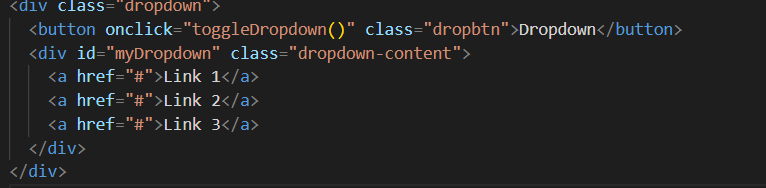
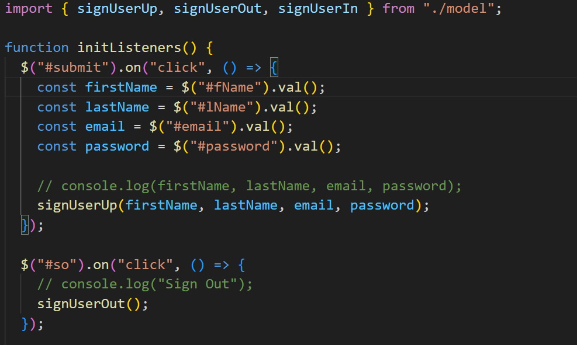
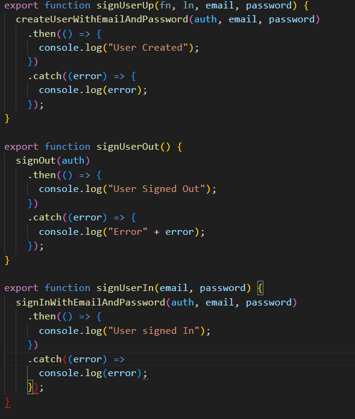

### Project Name

Final Project

### Github Link

https://github.com/GarciaEy/N220/tree/main/finalProjectOutline

### Major Features

- Allow users to add & remove tasks to the list or mark them as complete
  -  this image shows how you can add and remove a "friend" which will be applied to the task manager assigment via adding and removing tasks
- Allow users to change the text of the task and add any additonal properties to said task
  - this image shows a function that changes a factor of the friends task. for the task manager assignment this will be applied via changing properties inside of each task.
- user only sees tasks theyve created and make sure specific tasks are assigned to a specific user
  -  this image is an example of an if-else statment being used to show difffernt displays to the user depending on whether or not theyre signed in. this can can be used in the task manager assignment by showing the user the login screen and the entry dashboard when theyre logged out/not signed in vs showing the user the task managment features when they hit the log in button and are logged in. the dash board can also be changed to say "welcome [username]".
- Allow users to access a drop down menu that has the two options of indoor and outdoor tasks
  -  this image is an example of how a drop down menu can be achived in java script - this image is an example of a how a drop down menu can be achived using html (and the js snippet above)

**Login Form**

- DOM references: password and username inputs
- Logic:

  - username is empty => tell user to fill in username
  - Tell user to enter valid password

    - password is empty
    - password is less than 8 characters
    - password contains no capital letters
    - password contains no numbers

      -  this image is an example of an if-else statement being used to check that the user needs valid criteria to 'sign up' but for the case of the task manager assignment itll be the criteria for the login password listed above
      -  lastly, this image is an example of if-else function statments being used to not only show if the user is signed up/logged in but to also communicate to the user and provide an error alert if there is an error with their login.

- Events:
  - on login button click check login
